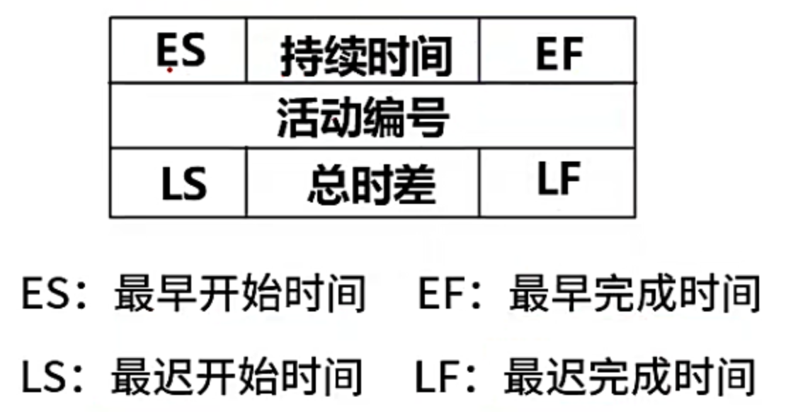

## 项目管理前言【95】

## 盈亏平衡分析【96】

- 【正常情况下】销售额 = 固定成本+可变成本+税费+利润。
- 【盈亏平衡时】销售额 = 固定成本+可变成本+税费。

## 进度管理【97】

#### 工作分解结构 WBS

###### 基本规则要求

- WBS 的工作包时可控和可管理的，不能过于复杂
- 任务分解也不能过细，一般原则 WBS 的树形结构不能超过 6 层
- 每个工作包要有一个交付成果
- 每个任务必须有明确定义的完成标准
- WBS 必须有利于责任分配

> 进度管理：为了确保项目按期完成所需要的管理过程

- 专家判断法
- **三点估算法**： （乐观时间+4*最可能时间+悲观时间）/ 6
- 功能点估算法
-  自下而上的估算
- 自上而下的估算

## 习题讲解【98】

## 进度管理-关键路径法【99】

## Gannt图【100】

## 进度控制【101】

- 是否是关键活动
- 偏差是否大于总时差
- 偏差是否大于自由时差
- 赶工：增加资源
- 快速更进：活动并行执行。

## 影响软件质量的3组因素【102】

#### 产品修改

- 可理解性
- 可维修性
- 灵活性
- 可测试性

#### 产品转移

- 可移植性
- 可再用性
- 互运行性

#### 产品运行

- 正确性
- 健壮性
- 效率
- 完整性
- 可用性
- 风险

## 软件质量控制与质量保证【103】

- **质量保证**：一般是每隔一定时间进行的，主要通过系统的质量审计和过程分析来保证项目的质量。独特工具包括：质量审计和过程分析。
- **质量控制**：是实时监控项目的具体结果，以判断他们是否符合相关质量标准，制定有效方案，以消除产生质量问题的原因。

#### 质量保证的主要目标

- 提前预防
- 尽量在刚刚引入缺陷时即将其捕获，而不是扩散到下一个阶段。
- 作用与【过程】而【不是最终产品】
- 贯穿与【所有的活动中】，而不是只集中于一点。

## 软件能力成熟度模型集成【CMMI】【104】

| 成熟度等级       | 特点                                   |
| ---------------- | -------------------------------------- |
| 初始级【L1】     | 随意且混乱、组织成功依赖于个人能力     |
| 已管理级【L2】   | 项目级可重复【建立了项目级的控制过程】 |
| 已定义级【L3】   | 组织级，文档化标准化                   |
| 定量管理级【L4】 | 量化式管理【过程性能可预测】           |
| 优化级【L5】     | 持续优化                               |

 

## 软件配置管理【105】

> 产品配置是指一个产品在其生命周期各个阶段所产生的各种形式（机器可读或人工可读）和各种版本的文档、计算机程序、部件及数据的集合。

#### 关于配置项

- 基线配置项（可交付成果）：需求文档、设计文档、源代码、可执行代码测试用例、运行软件所需数据等。
- 非基线配置项：各类计划（如项目管理计划，进度管理计划）、各类报告

> 软件配置管理核心内容包括【版本控制】和【变更控制】

## 习题讲解【106】

## 软件工具【107】

#### 按照软件过程活动将软件工具分为：

- 软件开发工具：需求分析工具、设计工具、编码与排错工具、测试工具。
- 软件维护工具：版本控制工具（VSS、CVS、SCCS、SVN）、文档分析工具、开发信息库工具、逆向工程工具、再工程工具。
- 软件管理和软件支持工具：项目管理工具、配置管理工具、软件评价工具、软件开发工具的评价 [maven配置说明.xml](../../../../../Documents/Java/maven配置说明.xml) 和选择。
