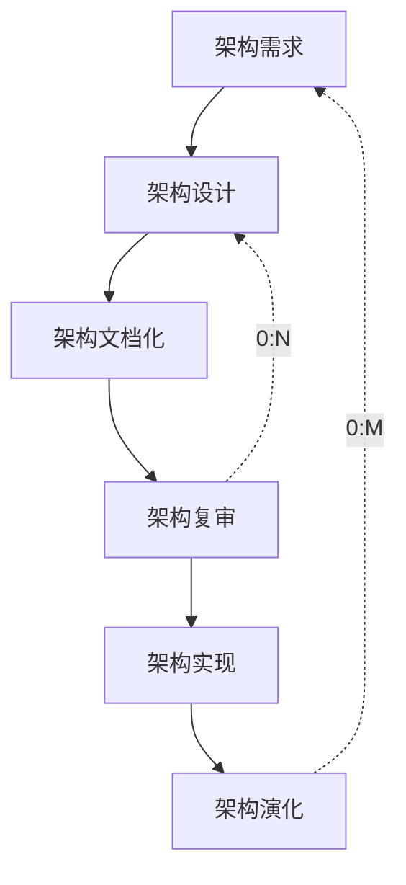

## 软件架构设计前言【131】

- 软件架构的概念
- **基于架构的软件开发**
- **软件架构风格**
- 特定领域软件架构
- **软件质量属性**
- **软件架构评估**
- 软件产品线
- 架构与中间件技术

## 软件架构的概念【132】

> 软件架构的本质
>
> - 软件架构为软件提供了一个结构、行为和属性的高级抽象
> - 软件架构风格是特定应用领域的惯用模式，架构定义一个词汇表和一组约束

> 架构的作用
>
> - 软件架构是项目干系人进行交流的手段
> - 软件架构师可传递和可复用的模型，通过研究软件架构可能预测软件质量
> - 软件架构使推理和控制更加简单，有助于循序渐进的原型设计，可以作为培训的基础

> 软件架构 = 软件体系结构
>
> 需求分析 ----- 架构 ----- 软件设计
>
> 架构设计就是需求分配，即 将满足需求的职责分配到组件上。

## 架构的发展历程【133】

1. 无架构阶段：（汇编语言）
2. 萌芽阶段：（程序结构设计）
3. 初级阶段：（统一建模语言）
4. 高级阶段：（4+1 视图）

   

## 软件架构风格 - ADL【134】

ADL 的三个基本元素：

- 构件
- 连接件
- 架构配置

## 基于架构的软件开发方法 【135】

### 概念

- ABSD 方法是架构驱动，即强调有业务、质量和功能需求的组合驱动架构设计。
- ABSD 方法的三个基础：
  - 功能的分解
  - 通过选择架构风格来实现质量和业务需求
  - 软件模板的使用
- 视角与视图：从不同的视角来检查，所以会有不同的视图。
- 用例用来捕获功能需求、特定场景用来捕获质量需求。

### 开发过程

> 在基于体系结构的软件设计方法中，采用（视角与视图）来描述软件架构，采用（用例）来描述功能需求，采用（质量场景）来描述质量需求。

