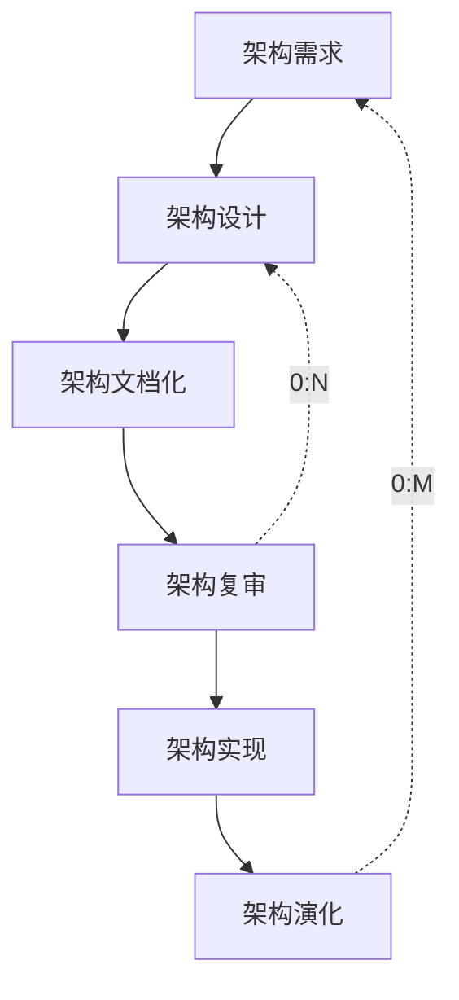
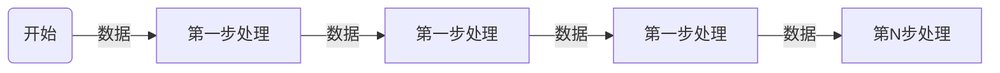
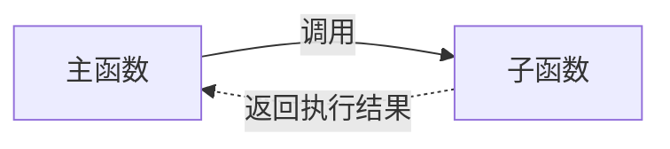
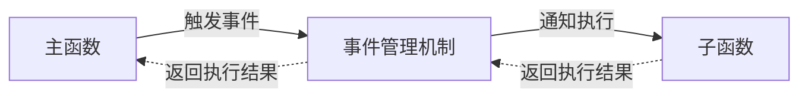
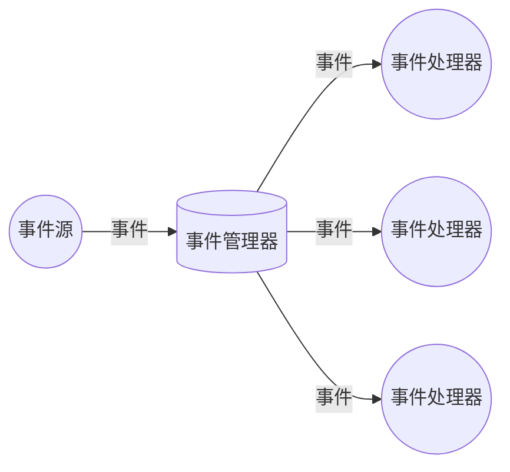
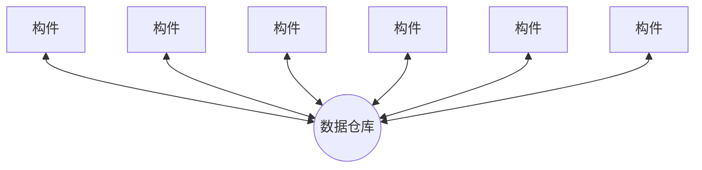
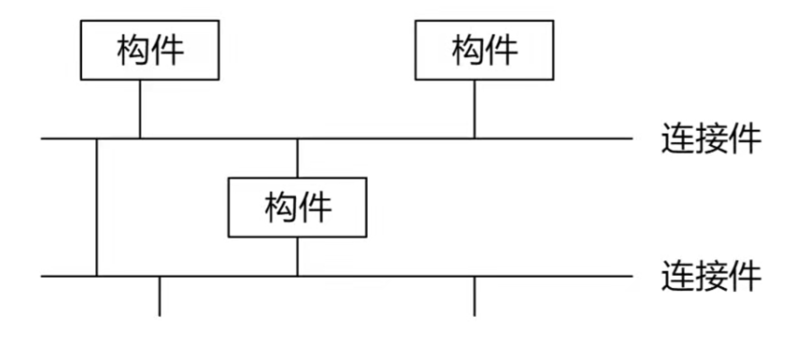

## 软件架构设计前言【131】

- 软件架构的概念
- **基于架构的软件开发**
- **软件架构风格**
- 特定领域软件架构
- **软件质量属性**
- **软件架构评估**
- 软件产品线
- 架构与中间件技术

## 软件架构的概念【132】

> 软件架构的本质
>
> - 软件架构为软件提供了一个结构、行为和属性的高级抽象
> - 软件架构风格是特定应用领域的惯用模式，架构定义一个词汇表和一组约束

> 架构的作用
>
> - 软件架构是项目干系人进行交流的手段
> - 软件架构师可传递和可复用的模型，通过研究软件架构可能预测软件质量
> - 软件架构使推理和控制更加简单，有助于循序渐进的原型设计，可以作为培训的基础

> 软件架构 = 软件体系结构
>
> 需求分析 ----- 架构 ----- 软件设计
>
> 架构设计就是需求分配，即 将满足需求的职责分配到组件上。

## 架构的发展历程【133】

1. 无架构阶段：（汇编语言）
2. 萌芽阶段：（程序结构设计）
3. 初级阶段：（统一建模语言）
4. 高级阶段：（4+1 视图）

   

## 软件架构风格 - ADL【134】

ADL 的三个基本元素：

- 构件
- 连接件
- 架构配置

## 基于架构的软件开发方法 【135】

### 概念

- ABSD 方法是架构驱动，即强调有业务、质量和功能需求的组合驱动架构设计。
- ABSD 方法的三个基础：
  - 功能的分解
  - 通过选择架构风格来实现质量和业务需求
  - 软件模板的使用
- 视角与视图：从不同的视角来检查，所以会有不同的视图。
- 用例用来捕获功能需求、特定场景用来捕获质量需求。

### 开发过程

> 在基于体系结构的软件设计方法中，采用（视角与视图）来描述软件架构，采用（用例）来描述功能需求，采用（质量场景）来描述质量需求。

## 软件架构风格-总概【136】

- 数据流风格

  > 批处理、管道过滤器

- 调用/返回风格

  > 主程序/子程序、面向对象、分层架构

- 独立构件风格

  > 进程通信、事件驱动系统

- 虚拟机风格

  > 解释器、规则系统

- 以数据为中心

  > 数据库系统、黑板系统、超文本系统

## 软件架构风格-数据流风格【137】

#### 优点

- 松耦合【高内聚、低耦合】
- 良好的重用性/可维护性
- 可扩展性【标准接口适配】
- 良好的隐蔽性
- 支持并行

#### 缺点

- 交互性差
- 复杂性高
- 性能较差（每个过滤器都需要解析与合成数据）

#### 典型实例

- 传统编译器
- 网络报文处理

### 批处理

> 大量**整体**数据、无需用户交互

### 管道过滤器

> 流式数据、弱用户交互

## 软件架构风格-调用/返回风格【138】

#### 主程序/子程序

> 面向过程

#### 面向对象

> 对象的方法调用

#### 分层

> 层与层之间的方法调用

### 分层架构风格

#### 优点

- 良好的重用性，只要接口不变可用在其他处。
- 可维护性好
- 可扩展性好，支持递增设计

#### 缺点

- 并不是每个系统都方便分层
- 很难找到一个合适的、正确的层次抽象方法
- 不同层次之间耦合度高的系统很难实现。

## 软件架构风格-独立构件风格【139】

#### 优点

- 松耦合
- 良好的重用性/可修改性/可扩展性

#### 缺点

- 构件放弃了对系统计算机的控制。一个构件触发一个事件时，不能确定其他构件是否会响应它。而且即使它知道事件注册了哪些构件的过程，它不能保证这些过程被调用的顺序。
- 数据交换的问题
- 既然过程的寓意必须依赖于被触发事件的上下文约束，关于正确性的推理

## 软件架构风格-（独立构件）事件管理器工作机制【140】

## 软件架构风格-虚拟机风格【141】

> 类似 java 虚拟机  

## 软件架构风格-（虚拟机）解释器风格的构成及各部分职能【142】

## 软件架构风格-（虚拟机）规则系统风格的构成及各部分职能【143】

> 基于规则的系统构成：规则集、规则解释器、规则/数据选择及工作内存，一般用在人工智能领域和 DSS（决策支持系统）中。

## 软件架构风格-仓库风格【144】

> 仓库风格：以数据为中心
>
> - 数据库风格
> - 黑板系统：语音识别、知识推理
> - 超文本系统

### 黑板风格

#### 优点：

- 可更改性
- 可维护性
- 可重用的知识源
- 容错性
- 健壮性

#### 缺点：

- 测试困难
- 不能保证有好的解决方案
- 难以建立好的控制策略
- 低效
- 开发困难
- 缺少并行机制

#### 特点

- 在以数据为中心的基础上，使用中心数据触发业务逻辑部件

#### 典型实例

- 语音识别
- 模式识别
- 图像处理
- 知识推理

## 软件架构风格-闭环风格（过程控制风格）【145】

- 适用于嵌入式系统，用于解决简单闭环控制问题
- 经典应用：空调温控，定速巡航

## 软件架构风格-C2风格【146】

#### C2架构的基本规则

- 构件和连接件都有一个顶部和底部
- 构件的顶部要连接到连接件的底部，构件的底部要连接到连接件的顶部，构件之间不允许直接连接
- 一个连接件可以和任意数目的其他构件和连接件连接。
- 当两个连接件进行直接连接时，必须有其中一个底部到另一个的顶部。

## 软件架构风格-习题讲解1【147】

> 架构风格判断

## 软件架构风格-习题讲解2【148】

## 软件架构风格-MDA【149】

#### MDA的3中核心模型

- 平台独立模型（PIM）：具有高抽象层次、独立于任何实现技术的模型。
- 平台相关模型（PSM）：为某种特定实现技术量身订做，让你用这种技术中可用的实现构造来描述系统的模型。PIM 会被变成一个或者多个 PSM
- 代码 Code：用源代码对系统的描述（规约）。每个 PSM 都将被变换成代码。

